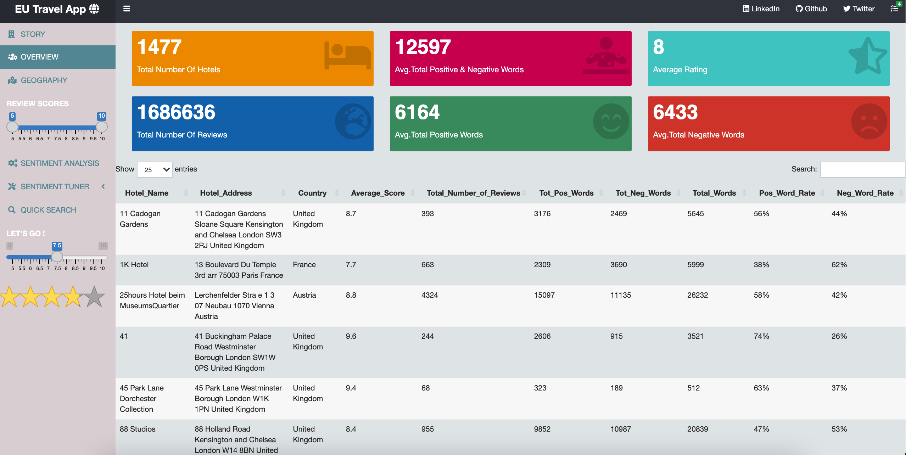

## @Author : Rupesh Kumar

# EU TRAVEL APPLICATION:
### **Travel recommendation application** [Click](https://rup-ash.shinyapps.io/EuTravel/)

The aim of this project is to conduct an in-depth analysis of European Hotel Reviews data set, using state of the art tools to creat functions that are convered into classes. The analysis will be presented via an online application coded in R Shiny. 

### FEATURES PREVIEW:
### **HOME PAPGE**

  

### **OVERVIEW PAGE**

  

### **GEOGRAPHY PAGE**

  

### **SENTIMENT ANALYSIS PAGE**

  

### **SENTIMENT TUNER**

  

### **QUICK SEARCH PAGE**

  

